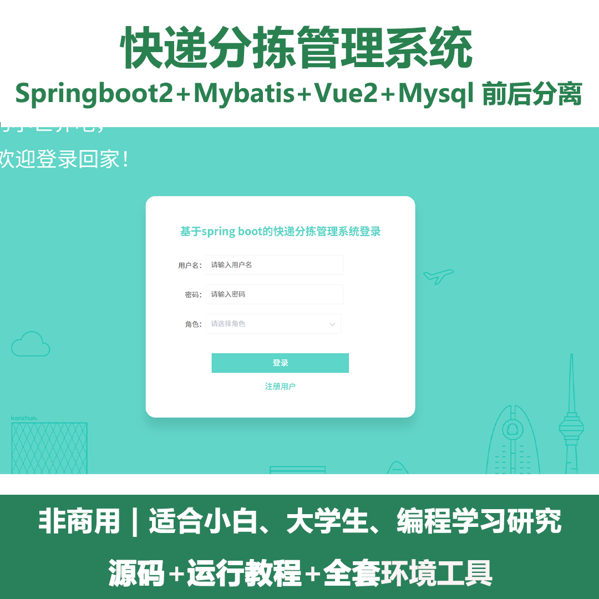
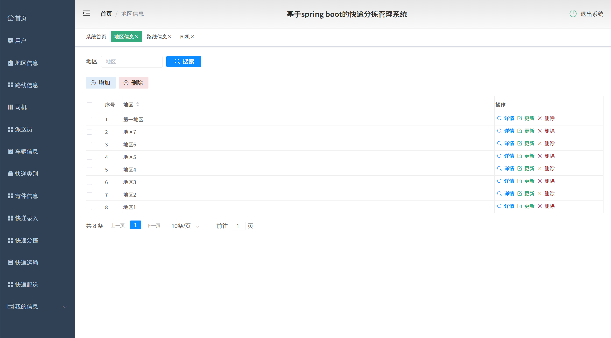
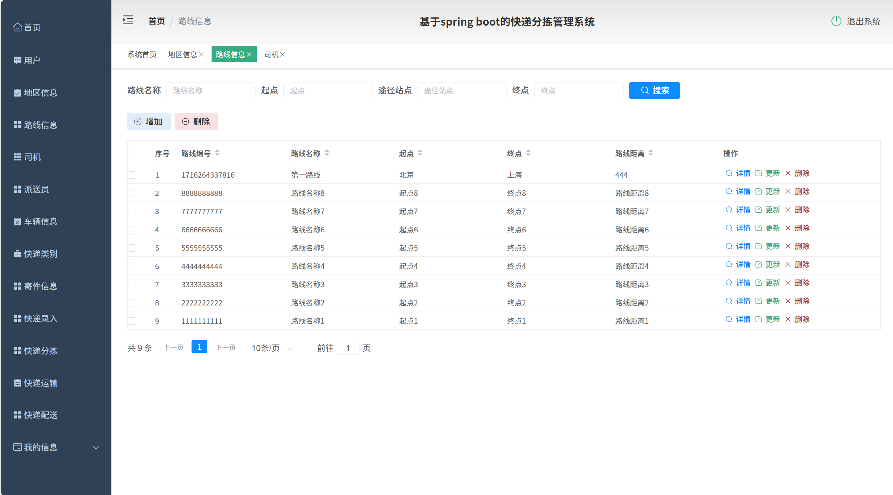
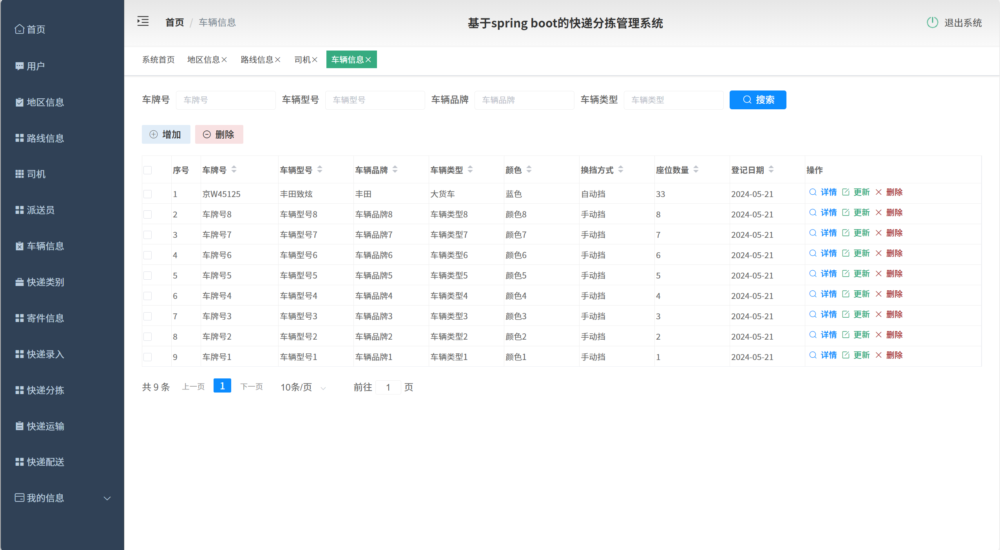
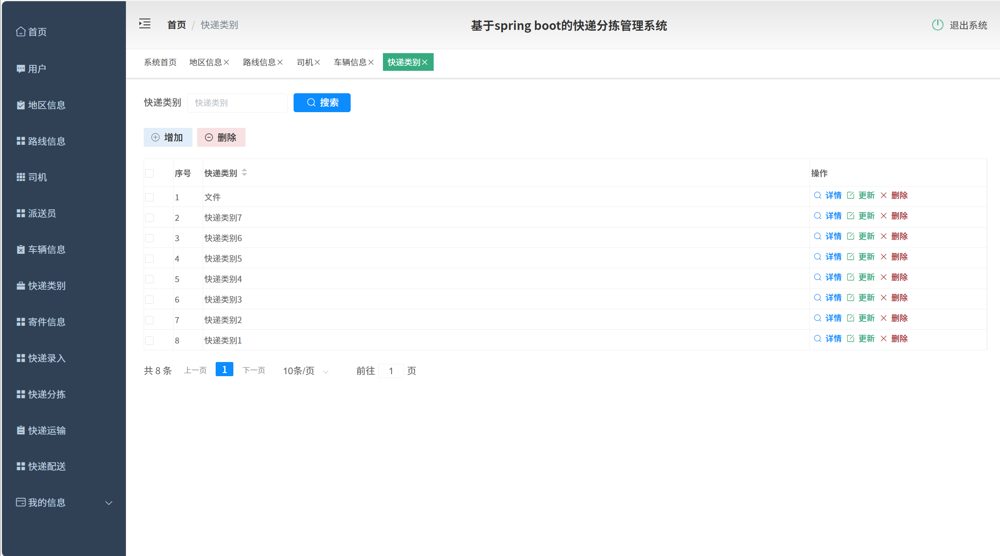
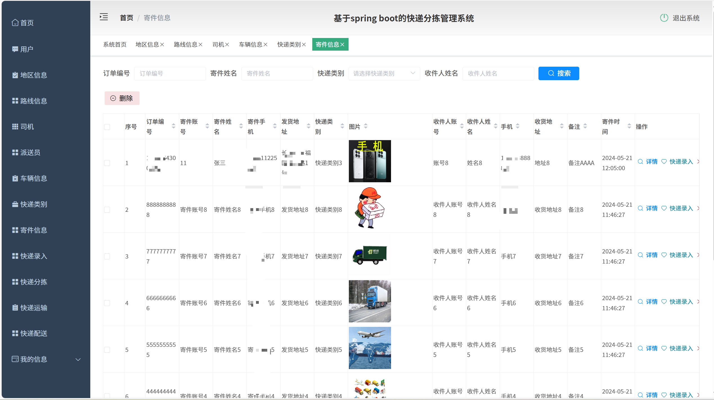
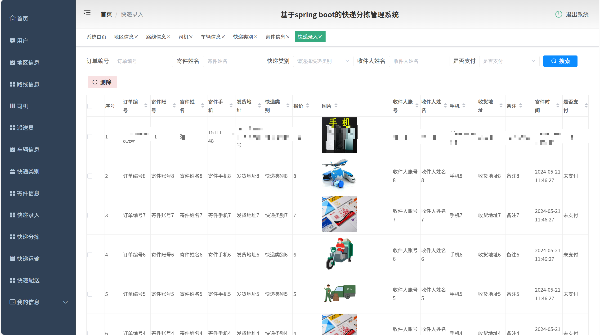
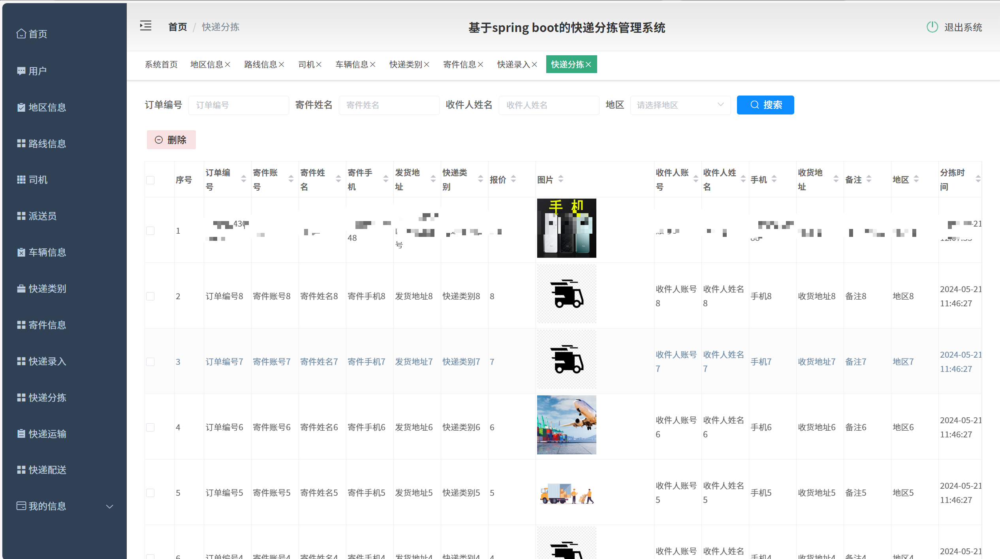
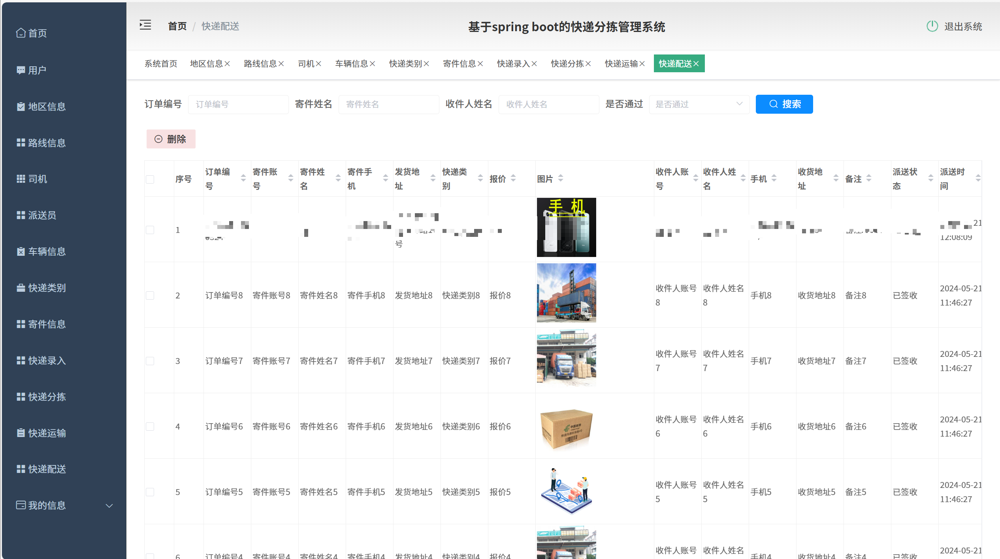

# springbootA416
springbootA416快递分拣管理系统
 
## 查看主页获取源码

### 一、关键词

快递分拣调度系统，快递分拣自动化管理系统，快递分拨管理系统
 

### 二、作品包含

源码+数据库+全套环境和工具资源+部署教程

 

### 三、项目技术

前端技术：Html、Css、Js、Vue2.0、Element-ui 
后端技术：Java、SpringBoot2.0、MyBatis

  

 

### 四、运行环境（以下版本亲测，其他版本未知，请自测）

开发工具：IDEA/eclipse  + VSCODE

数据库：MySQL5.7（最低要5.7版本）

数据库管理工具：Navicat10以上版本

环境配置软件： JDK1.8 + Maven3.6.3

前端Nodejs：14

浏览器：谷歌浏览器

 

### 五、项目介绍

项目编号：springbootA416

快递分拣管理系统可智能化统筹快递分拣全流程，实现包裹快速分类、路径优化及数据追踪，提升物流效率并降低运营成本
基础信息管理：管理地区、路线、司机、派送员、车辆、快递类别信息，支持增删改查 。
寄件与快递流程：处理寄件信息录入，涵盖订单、寄件人、收件人等内容；依次进行快递录入、分拣、运输、配送操作，跟踪各环节状态 。
系统辅助：含用户模块、个人信息管理，及各功能模块通用的查询、删除操作 。

### 六、运行截图

